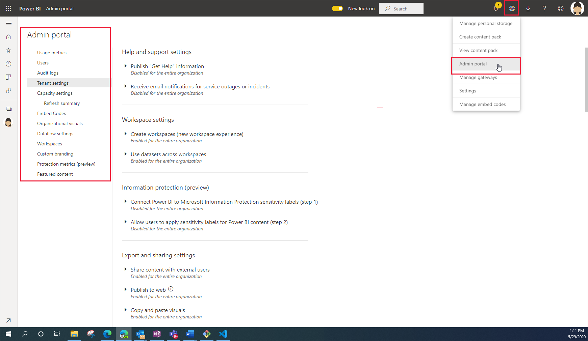

# What is Power BI administration

Power BI administration is the management of the organization-wide settings that control how Power BI works. Users that are assigned to admin roles configure, monitor, and provision organizational resources. This article provides an overview of administration roles, tasks, and tools to help you get started.

## Administrator roles related to Power BI

There are several roles that work together to administer Power BI for your organization. Most admin roles are assigned in the Microsoft 365 admin center or by using PowerShell. The Power BI Premium Capacity and Power BI Embedded Capacity admin roles are assigned when the capacity is created. To learn more about each of the admin roles, see [About admin roles](/microsoft-365/admin/add-users/about-admin-roles). To learn how to assign admin roles, see [Assign admin roles](/microsoft-365/admin/add-users/assign-admin-roles).

| **Type of administrator** | **Administrative scope** | **Power BI tasks** |
| --- | --- | --- |
| Global admin | Microsoft 365 | Has unlimited access to all management features for the organization |
| | | Assigns roles to other users |
| Billing admin | Microsoft 365 | Manage subscriptions |
| | | Purchase licenses |
| License admin | Microsoft 365 | Assign or remove licenses for users |
| User admin | Microsoft 365 | Create and manage users and groups |
| | | Reset user passwords |
| Power BI admin | Power BI service | Full access to Power BI management tasks|
| | | Enable and disable Power BI features |
| | | Report on usage and performance |
| | | Review and manage auditing |
| Power BI Premium Capacity admin | A single Premium capacity | Assign workspaces to the capacity|
| | | Manage user permission to the capacity |
| | | Manage workloads to configure memory usage |
| | | Restart the capacity |
| Power BI Embedded Capacity admin | A single Embedded capacity | Assign workspaces to the capacity|
| | | Manage user permission to the capacity |
| | | Manage workloads to configure memory usage |
| | | Restart the capacity |

## Administrative tasks and tools

Power BI admins work mostly in the Power BI admin portal. You should, however, be familiar with related tools and admin centers. Look at the table above to determine which role is required to do tasks using the tools listed here.

| **Tool** | **Typical tasks** |
| --- | --- |
| [Power BI Admin portal](https://app.powerbi.com/admin-portal) | Acquire and work with Premium capacity |
| | Ensure quality of service |
| | Manage workspaces |
| | Publish Power BI visuals |
| | Verify codes used to embed Power BI in other applications |
| | Troubleshoot data access and other issues |
| [Microsoft 365 admin center](https://admin.microsoft.com) | Manage users and groups |
| | Purchase and assign licenses |
| | Block users from accessing Power BI |
| [Microsoft 365 Security & Compliance Center](https://protection.office.com) | Review and manage auditing |
| | Data classification and tracking |
| | Data loss prevention policies |
| | Information governance |
| [Azure Active Directory in the Azure portal](https://aad.portal.azure.com) | Configure conditional access to Power BI resources |
| | Provision Power BI Embedded capacity |
| [PowerShell cmdlets](/powershell/power-bi/overview) | Manage workspaces and other aspects of Power BI through scripts |
| [Administrative APIs and SDK](service-admin-reference.md) | Build custom admin tools. For example, Power BI Desktop can use these APIs to build reports based on data related to administration. |

## Next steps

Now that you know the basics of what’s involved with Power BI administration, consult these articles to learn more:

- [Use the Power BI admin portal](service-admin-portal.md)
- [Tenant settings guidance](../guidance/admin-tenant-settings.md)
- [Use PowerShell cmdlets](/powershell/power-bi/overview)
- [Power BI administration FAQ](service-admin-faq.md)
- [Licensing the Power BI service for users in your organization](service-admin-licensing-organization.md)
- Questions? [Try asking the Power BI Community](https://community.powerbi.com/)
- Suggestions? [Contribute ideas to improve Power BI](https://ideas.powerbi.com/)