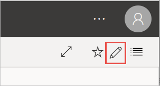
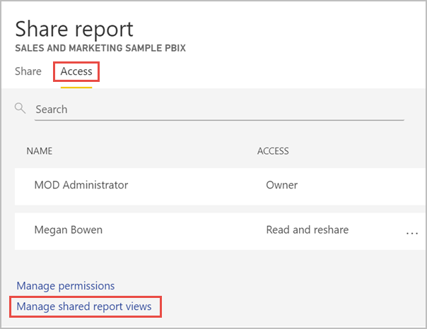
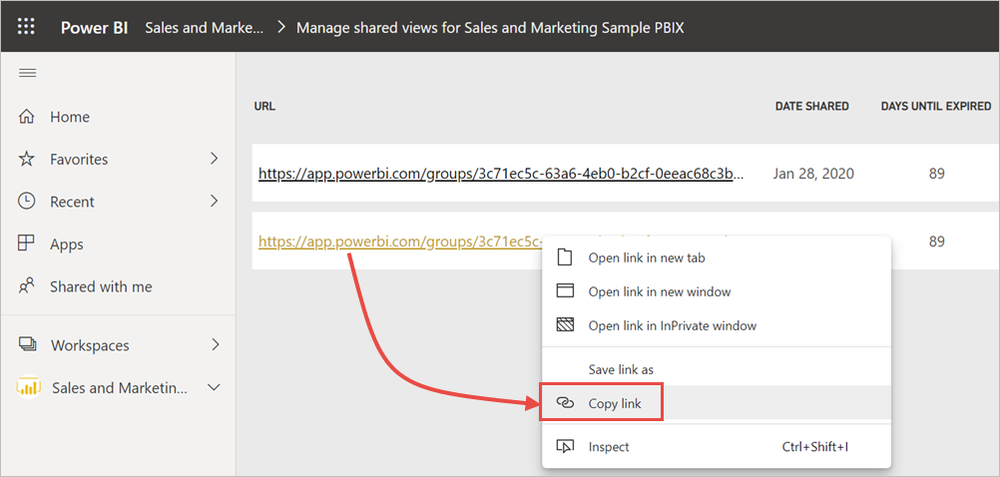

# Filter and share a Power BI report
*Sharing* is a good way to give a few people access to your dashboards and reports. What if you want to share a filtered version of a report? Maybe you want the report to show only data for a specific city or salesperson or year. This article explains how to filter a report and share the filtered version of the report. Another way to share a filtered report is to [add query parameters to the report URL](service-url-filters.md). In both cases, the report is filtered when recipients first open it. They can clear the filter selections in the report.

Power BI also offers [other ways to collaborate and distribute your reports](service-how-to-collaborate-distribute-dashboards-reports.md). With sharing, you and your recipients need a [Power BI Pro license](../fundamentals/service-features-license-type.md), or the content needs to be in a [Premium capacity](../admin/service-premium-what-is.md). 

## Follow along with sample data

This article uses the Marketing and Sales sample template app. Want to try it? 

1. Install the [Marketing and Sales sample template app](https://appsource.microsoft.com/product/power-bi/microsoft-retail-analysis-sample.salesandmarketingsample?tab=Overview).
2. Select the app and select **Explore app**.

   

3. Select the pencil icon to open the workspace that you installed with the app.

    

4. In the workspace content list, select **Reports**, then select the report **Sales and Marketing Sample PBIX**.

    

    Now you're ready to follow along.

## Set a filter in the report

Open a report in [Editing view](../consumer/end-user-reading-view.md) and apply a filter.

In this example, we're filtering the YTD Category page of the Marketing and Sales sample template app to show only values where **Region** equals **Central**. 
 

Save the report.

## Share the filtered report

1. Select **Share**.

   

2. Clear **Send email notification to recipients**, so you can send a filtered link instead, select **Share report with current filters and slicers**, then select **Share**.

    

4. Select **Share** again.

   

5. Select the **Access** tab, then select **Manage shared report views**.

    

6. Right-click the URL you want, and select **Copy link**.

    

7. When you share this link, recipients will see your filtered report. 

## Limitations and considerations
Things to keep in mind about sharing reports:

* When you share a dataset by managing permissions, by sharing reports or dashboards, or by publishing an app, you're granting access access to the entire dataset unless [row-level security (RLS)](../admin/service-admin-rls.md) limits their access. Report authors may use capabilities that customize user experiences when viewing or interacting with reports, for example hiding columns, limiting the actions on visuals, and others. These customized user experience do not restrict what data users can access in the dataset. Use [row-level security (RLS)](../admin/service-admin-rls.md) in the dataset so that each person's credentials determine which data they can access.

## Next steps
* [Ways to share your work in Power BI](service-how-to-collaborate-distribute-dashboards-reports.md)
* [Share a dashboard](service-share-dashboards.md)
* More questions? [Try the Power BI Community](https://community.powerbi.com/).
* Have feedback? Go to the [Power BI Community site](https://community.powerbi.com/) with your suggestions.
