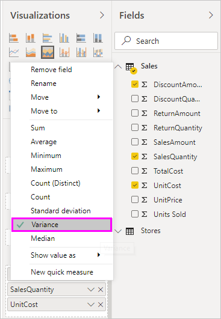

# Customize tooltips in Power BI Desktop

Tooltips are an elegant way of providing more contextual information and detail to data points on a visual. The following image shows a tooltip applied to a chart in Power BI Desktop.

When a visualization is created, the default tooltip displays the data point's value and category. There are many instances when customizing the tooltip information is useful. Customizing tooltips provides additional context and information for users viewing the visual. Custom tooltips enable you to specify additional data points that display as part of the tooltip.

## How to customize tooltips

To create a customized tooltip, in the **Fields** well of the **Visualizations** pane, drag a field into the **Tooltips** bucket, shown in the following image. In the following image, three fields have been placed into the **Tooltips** bucket.

Once tooltips are added to **Tooltips**, hovering over a data point on the visualization shows the values for those fields.

## Customizing tooltips with aggregation or quick measures

You can further customize a tooltip by selecting an aggregation function or a *quick measure*. Select the arrow beside the field in the **Tooltips** bucket. Then, select from the available options.

There are many ways to customize tooltips, using any field available in your dataset, to convey quick information and insights to users viewing your dashboards or reports.
