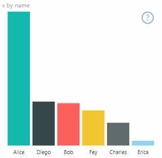

# High-contrast mode support in Power BI visuals

The Windows *high contrast* setting makes text and apps easier to see by displaying more distinct colors. This article discusses how to add high-contrast mode support to Power BI visuals. For more information, see [high-contrast support in Power BI](https://powerbi.microsoft.com/blog/power-bi-desktop-june-2018-feature-summary/#highContrast).

To view an implementation of high-contrast support, go to the [PowerBI-visuals-sampleBarChart visual repository](https://github.com/Microsoft/PowerBI-visuals-sampleBarChart/commit/61011c82b66ca0d3321868f1d089c65101ca42e6).

## On initialization

The colorPalette member of `options.host` has several properties for high-contrast mode. Use these properties to determine whether high-contrast mode is active and, if it is, what colors to use.

### Detect that Power BI is in high-contrast mode

If `host.colorPalette.isHighContrast` is `true`, high-contrast mode is active and the visual should draw itself accordingly.

### Get high-contrast colors

In high-contrast mode, your visual should limit itself to the following settings:

* **Foreground** color is used to draw any lines, icons, text, and outline or fill of shapes.
* **Background** color is used for background, and as the fill color of outlined shapes.
* **Foreground - selected** color is used to indicate a selected or active element.
* **Hyperlink** color is used only for hyperlink text.

> [!NOTE]
> If a secondary color is needed, foreground color may be used with some opacity (Power BI native visuals use 40% opacity). Use this sparingly to keep the visual details easy to see.

During initialization, you can store the following values:

```typescript
private isHighContrast: boolean;

private foregroundColor: string;
private backgroundColor: string;
private foregroundSelectedColor: string;
private hyperlinkColor: string;
//...

constructor(options: VisualConstructorOptions) {
    this.host = options.host;
    let colorPalette: ISandboxExtendedColorPalette = host.colorPalette;
    //...
    this.isHighContrast = colorPalette.isHighContrast;
    if (this.isHighContrast) {
        this.foregroundColor = colorPalette.foreground.value;
        this.backgroundColor = colorPalette.background.value;
        this.foregroundSelectedColor = colorPalette.foregroundSelected.value;
        this.hyperlinkColor = colorPalette.hyperlink.value;
    }
```

Or you can store the `host` object during initialization and access the relevant `colorPalette` properties during update.

## On update

The specific implementations of high-contrast support vary from visual to visual and depend on the details of the graphic design. To keep important details easy to distinguish with the limited colors, high-contrast mode ordinarily requires a design that's slightly different from the default mode.

Power BI native visuals follow these guidelines:

* All data points use the same color (foreground).
* All text, axes, arrows, lines, and so on use the foreground color.
* Thick shapes are drawn as outlines, with thick strokes (at least two pixels) and background color fill.
* When data points are relevant, they're distinguished by different marker shapes, and data lines are distinguished by different dashing.
* When a data element is highlighted, all other elements change their opacity to 40%.
* For slicers, active filter elements use foreground-selected color.

In the following sample bar chart, for example, all bars are drawn with two pixels of thick foreground outline and background fill. Compare the way it looks with default colors and with a couple of high-contrast themes:




The next section shows one place in the `visualTransform` function that was changed to support high contrast. It's called as part of rendering during the update.

### Before

```typescript
for (let i = 0, len = Math.max(category.values.length, dataValue.values.length); i < len; i++) {
    let defaultColor: Fill = {
        solid: {
            color: colorPalette.getColor(category.values[i] + '').value
        }
    };

    barChartDataPoints.push({
        category: category.values[i] + '',
        value: dataValue.values[i],
        color: getCategoricalObjectValue<Fill>(category, i, 'colorSelector', 'fill', defaultColor).solid.color,
        selectionId: host.createSelectionIdBuilder()
            .withCategory(category, i)
            .createSelectionId()
    });
}
```

### After

```typescript
for (let i = 0, len = Math.max(category.values.length, dataValue.values.length); i < len; i++) {
    const color: string = getColumnColorByIndex(category, i, colorPalette);

    const selectionId: ISelectionId = host.createSelectionIdBuilder()
        .withCategory(category, i)
        .createSelectionId();

    barChartDataPoints.push({
        color,
        strokeColor,
        strokeWidth,
        selectionId,
        value: dataValue.values[i],
        category: `${category.values[i]}`,
    });
}

//...

function getColumnColorByIndex(
    category: DataViewCategoryColumn,
    index: number,
    colorPalette: ISandboxExtendedColorPalette,
): string {
    if (colorPalette.isHighContrast) {
        return colorPalette.background.value;
    }

    const defaultColor: Fill = {
        solid: {
            color: colorPalette.getColor(`${category.values[index]}`).value,
        }
    };

    return getCategoricalObjectValue<Fill>(category, index, 'colorSelector', 'fill', defaultColor).solid.color;
}
```
