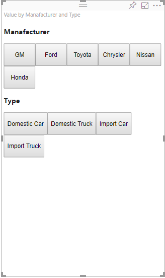
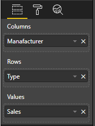

# Add interactivity into visual by Power BI visuals selections

Power BI provides two ways of interaction between visuals - selection and filtering. The sample below demonstrates how to select any items in one visual and notify other visuals in the report about new selection state.

`Selection` object corresponds to the interface:

```typescript
export interface ISelectionId {
    equals(other: ISelectionId): boolean;
    includes(other: ISelectionId, ignoreHighlight?: boolean): boolean;
    getKey(): string;
    getSelector(): Selector;
    getSelectorsByColumn(): SelectorsByColumn;
    hasIdentity(): boolean;
}
```

## How to use SelectionManager to select data points

The visual host object provides the method for creating an instance of selection manager. The selection manager responsible to select, to clear selection, to show the context menu, to store current selections and check selection state. And the selection manager has corresponded methods for those actions.

### Create an instance of the selection manager

For using the selection manager, you need to create the instance of a selection manager. Usually, visuals create a selection manager instance in the `constructor` of the visual object.

```typescript
export class Visual implements IVisual {
    private target: HTMLElement;
    private host: IVisualHost;
    private selectionManager: ISelectionManager;
    // ...
    constructor(options: VisualConstructorOptions) {
        this.host = options.host;
        // ...
        this.selectionManager = this.host.createSelectionManager();
    }
    // ...
}
```

### Create an instance of the selection builder

When the selection manager instance is created, you need to create `selections` for each data point of the visual. The visual host object provides `createSelectionIdBuilder` method to generate selection for each data point. This method return instance of the object with interface `powerbi.visuals.ISelectionIdBuilder`:

```typescript
export interface ISelectionIdBuilder {
    withCategory(categoryColumn: DataViewCategoryColumn, index: number): this;
    withSeries(seriesColumn: DataViewValueColumns, valueColumn: DataViewValueColumn | DataViewValueColumnGroup): this;
    withMeasure(measureId: string): this;
    withMatrixNode(matrixNode: DataViewMatrixNode, levels: DataViewHierarchyLevel[]): this;
    withTable(table: DataViewTable, rowIndex: number): this;
    createSelectionId(): ISelectionId;
}
```

This object has corresponded methods to create `selections` for different types of data view mappings.

> [!NOTE]
> The methods `withTable` and `withMatrixNode` were introduced on API 2.5.0 of the Power BI visuals.
> If you need to use selections for table or matrix data view mappings you need to update API version to 2.5.0 or higher.

### Create selections for categorical data view mapping

Let's review how selections represent on categorical data view mapping for sample dataset:

| Manufacturer | Type | Value |
| - | - | - |
| Chrysler | Domestic Car | 28883 |
| Chrysler | Domestic Truck | 117131 |
| Chrysler | Import Car | 0 |
| Chrysler | Import Truck | 6362 |
| Ford | Domestic Car | 50032 |
| Ford | Domestic Truck | 122446 |
| Ford | Import Car | 0 |
| Ford | Import Truck | 0 |
| GM | Domestic Car | 65426 |
| GM | Domestic Truck | 138122 |
| GM | Import Car | 197 |
| GM | Import Truck | 0 |
| Honda | Domestic Car | 51450 |
| Honda | Domestic Truck | 46115 |
| Honda | Import Car | 2932 |
| Honda | Import Truck | 0 |
| Nissan | Domestic Car | 51476 |
| Nissan | Domestic Truck | 47343 |
| Nissan | Import Car | 5485 |
| Nissan | Import Truck | 1430 |
| Toyota | Domestic Car | 55643 |
| Toyota | Domestic Truck | 61227 |
| Toyota | Import Car | 20799 |
| Toyota | Import Truck | 23614 |

And the visual uses the following data view mapping:

```json
{
    "dataRoles": [
        {
            "displayName": "Columns",
            "name": "columns",
            "kind": "Grouping"
        },
        {
            "displayName": "Rows",
            "name": "rows",
            "kind": "Grouping"
        },
        {
            "displayName": "Values",
            "name": "values",
            "kind": "Measure"
        }
    ],
    "dataViewMappings": [
        {
            "categorical": {
                "categories": {
                    "for": {
                        "in": "columns"
                    }
                },
                "values": {
                    "group": {
                        "by": "rows",
                        "select": [
                            {
                                "for": {
                                    "in": "values"
                                }
                            }
                        ]
                    }
                }
            }
        }
    ]
}
```

In the sample, `Manufacturer` is `columns` and `Type` is `rows`. There's series created by groupings values by `rows` (`Type`).

And visual should able to slice data by `Manufacturer` and `Type` too.

For example, when user selects `Chrysler` by  `Manufacturer`, other visuals should show following data:

| Manufacturer | Type | Value |
| - | - | - |
| **Chrysler** | Domestic Car | 28883 |
| **Chrysler** | Domestic Truck | 117131 |
| **Chrysler** | Import Car | 0 |
| **Chrysler** | Import Truck | 6362 |

When user selects `Import Car` by  `Type` (selects data by series), other visuals should show following data:

| Manufacturer | Type | Value |
| - | - | - |
| Chrysler | **Import Car** | 0 |
| Ford | **Import Car** | 0 |
| GM | **Import Car** | 197 |
| Honda | **Import Car** | 2932 |
| Nissan | **Import Car** | 5485 |
| Toyota | **Import Car** | 20799 |



Need to fill the visual data baskets.



There are `Manufacturer` as category (columns), `Type` as series (rows) and `Value` as `Values` for series.

> [!NOTE]
> The `Values` are required for series because according to data view mapping the visual expects that `Values` will be grouped by `Rows` data.

#### Create selections for categories

```typescript
// categories
const categories = dataView.categorical.categories;

// create label for 'Manufacturer' column
const p = document.createElement("p") as HTMLParagraphElement;
p.innerText = categories[0].source.displayName.toString();
this.target.appendChild(p);

// get count of category elements
const categoriesCount = categories[0].values.length;

// iterate all categories to generate selection and create button elements to use selections
for (let categoryIndex = 0; categoryIndex < categoriesCount; categoryIndex++) {
    const categoryValue: powerbi.PrimitiveValue = categories[0].values[categoryIndex];

    const categorySelectionId = this.host.createSelectionIdBuilder()
        .withCategory(categories[0], categoryIndex) // we have only one category (only one `Manufacturer` column)
        .createSelectionId();
    this.dataPoints.push({
        value: categoryValue,
        selection: categorySelectionId
    });
    console.log(categorySelectionId);

    // create button element to apply selection on click
    const button = document.createElement("button") as HTMLButtonElement;
    button.value = categoryValue.toString();
    button.innerText = categoryValue.toString();
    button.addEventListener("click", () => {
        // handle click event to apply correspond selection
        this.selectionManager.select(categorySelectionId);
    });
    this.target.appendChild(button);
}
```

In the sample code, you can see that we iterate all categories. And in each iteration, we call `createSelectionIdBuilder` to create the next selection for each category by calling `withCategory` method of the selection builder. The method `createSelectionId` is used as a final method to return the generated `selection` object.

In `withCategory` method, we pass the column of `category`, in the sample, it's `Manufacturer` and index of category element.

#### Create selections for series

```typescript
// get groupped values for series
const series: powerbi.DataViewValueColumnGroup[] = dataView.categorical.values.grouped();

// create label for 'Type' column
const p2 = document.createElement("p") as HTMLParagraphElement;
p2.innerText = dataView.categorical.values.source.displayName;
this.target.appendChild(p2);

// iterate all series to generate selection and create button elements to use selections
series.forEach( (ser: powerbi.DataViewValueColumnGroup) => {
    // create selection id for series
    const seriesSelectionId = this.host.createSelectionIdBuilder()
        .withSeries(dataView.categorical.values, ser)
        .createSelectionId();

    this.dataPoints.push({
        value: ser.name,
        selection: seriesSelectionId
    });

    // create button element to apply selection on click
    const button = document.createElement("button") as HTMLButtonElement;
    button.value =ser.name.toString();
    button.innerText = ser.name.toString();
    button.addEventListener("click", () => {
        // handle click event to apply correspond selection
        this.selectionManager.select(seriesSelectionId);
    });
    this.target.appendChild(button);
});
```

### Create selections for table data view mapping

Sample of table data views mapping

```json
{
    "dataRoles": [
        {
            "displayName": "Values",
            "name": "values",
            "kind": "GroupingOrMeasure"
        }
    ],
    "dataViewMappings": [
        {
            "table": {
                "rows": {
                    "for": {
                        "in": "values"
                    }
                }
            }
        }
    ]
}
```

To create a selection for each row of table data view mapping, you need to call `withTable` method of selection builder.

```typescript
public update(options: VisualUpdateOptions) {
    const dataView = options.dataViews[0];
    dataView.table.rows.forEach((row: DataViewTableRow, rowIndex: number) => {
        this.target.appendChild(rowDiv);
        const selection: ISelectionId = this.host.createSelectionIdBuilder()
            .withTable(dataView.table, rowIndex)
            .createSelectionId();
    }
}
```

The visual code iterates the rows of the table and each row calls `withTable` table method. Parameters of `withTable` method are `table` object and index of the table row.

### Create selections for matrix data view mapping

```typescript
public update(options: VisualUpdateOptions) {
    const host = this.host;
    const rowLevels: powerbi.DataViewHierarchyLevel[] = dataView.matrix.rows.levels;
    const columnLevels: powerbi.DataViewHierarchyLevel[] = dataView.matrix.columns.levels;

    // iterate rows hierarchy
    nodeWalker(dataView.matrix.rows.root, rowLevels);
    // iterate columns hierarchy
    nodeWalker(dataView.matrix.columns.root, columnLevels);

    function nodeWalker(node: powerbi.DataViewMatrixNode, levels: powerbi.DataViewHierarchyLevel[]) {
        const nodeSelection = host.createSelectionIdBuilder().withMatrixNode(node, levels);

        if (node.children && node.children.length) {
            node.children.forEach(child => {
                nodeWalker(child, levels);
            });
        }
    }
}
```

In the sample, `nodeWalker` calls recursively for each node and child nodes.

`nodeWalker` creates `nodeSelection` object on each call. And each `nodeSelection` represent `selection` of correspond nodes.

## Select datapoints to slice other visuals

In the sample, codes of selections for categorical data view mapping, you saw that we created a click handler for button elements. The handler calls `select` method of the selection manager and passes the selection object.

```typescript
button.addEventListener("click", () => {
    // handle click event to apply correspond selection
    this.selectionManager.select(categorySelectionId);
});
```

The interface of `select` method is

```typescript
interface ISelectionManager {
    // ...
    select(selectionId: ISelectionId | ISelectionId[], multiSelect?: boolean): IPromise<ISelectionId[]>;
    // ...
}
```

You can see `select` can accept an array of selections. It means your visual can select several datapoints. The second parameter `multiSelect` responsible for multi-select. If the value is true, Power BI doesn't clear the previous selection state and apply current selection otherwise previous selection will reset.

The typical scenario of using `multiSelect` handling CTRL button state on click event.

```typescript
button.addEventListener("click", (mouseEvent) => {
    const multiSelect = (mouseEvent as MouseEvent).ctrlKey;
    this.selectionManager.select(seriesSelectionId, multiSelect);
});
```

## Next steps

* [Read how to use selections for binding visual properties to data points](objects-properties.md#objects-selector)

* [Read how to handle selections on bookmarks switching](bookmarks-support.md#visuals-with-selection)

* [Read how to add context menu for visuals data points](context-menu.md)

* [Read how to use InteractivityUtils to add selections into Power BI Visuals](utils-interactivity-selections.md)
