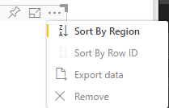

# Sorting options for Power BI visuals

This article describes how *sorting* options specify the sorting behavior for Power BI visuals. 

The sorting capability requires one of the following parameters.

## Default sorting

The `default` option is the simplest form. It allows sorting the data presented in the 'DataMappings' section. The option enables sorting of the data mappings by the user and specifies the sorting direction.

```json
    "sorting": {
        "default": {   }
    }
```



## Implicit sorting

Implicit sorting is sorting with the array parameter `clauses`, which describes sorting for each data role. `implicit` means that the visual's user can't change the sorting order. Power BI doesn't display sorting options in the visual's menu. However, Power BI does sort data according to specified settings.

`clauses` parameters can contain several objects with two parameters:

- `role`: Determines `DataMapping` for sorting
- `direction`: Determines sort direction (1 = Ascending, 2 = Descending)

```json
    "sorting": {
        "implicit": {
            "clauses": [
                {
                    "role": "category",
                    "direction": 1
                },
                {
                    "role": "measure",
                    "direction": 2
                }
            ]
        }
    }
```

## Custom sorting

Custom sorting means that the sorting is managed by the developer in the visual's code.
