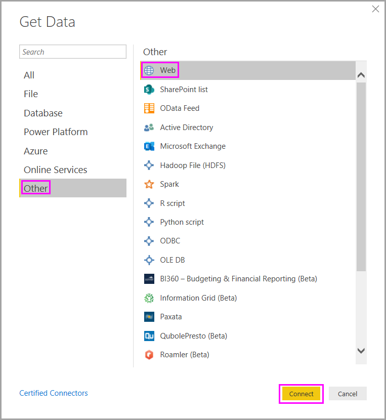
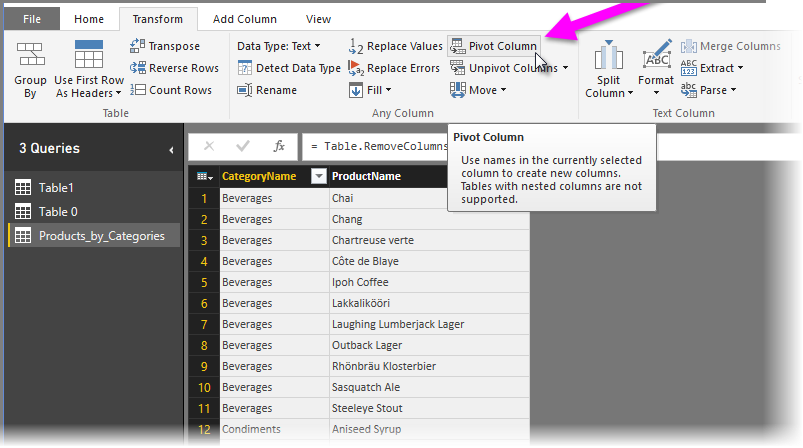
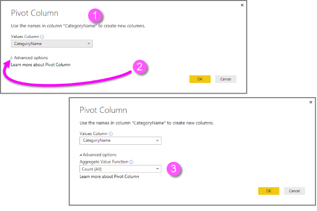
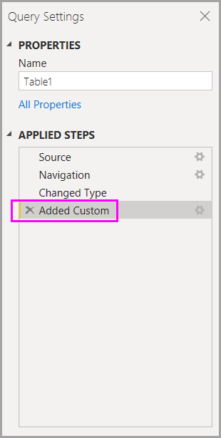

# Perform common query tasks in Power BI Desktop

In the Power Query Editor window of Power BI Desktop, there are a handful of commonly used tasks. This article demonstrates those common tasks and provides links for additional information.

The common query tasks demonstrated here are:

* Connect to data
* Shape and combine data
* Group rows
* Pivot columns
* Create custom columns
* Query formulas

We’ll use a few data connections to complete these tasks. The data is available for you to download or connect to, in case you want to step through these tasks yourself.

The first data connection is [an Excel workbook](https://download.microsoft.com/download/5/7/0/5701F78F-C3C2-450C-BCCE-AAB60C31051D/PBI_Edu_ELSi_Enrollment_v2.xlsx), which you can download and save locally. The other is a Web resource that's also used in other Power BI Desktop articles:

<https://www.bankrate.com/retirement/best-and-worst-states-for-retirement/>

Common query tasks begin at the steps necessary to connect to both of those data sources.

## Connect to data

To connect to data in Power BI Desktop, select **Home** and then **Get Data**. Power BI Desktop presents a menu with the most common data sources. For a complete list of data sources to which Power BI Desktop can connect, select **More** at the end of the menu. For more information, see [Data sources in Power BI Desktop](../connect-data/desktop-data-sources.md).

To start, select **Excel**, specify the Excel workbook mentioned earlier, and then select **Open**. Query inspects the workbook, then presents the data it found in the **Navigator** dialog box after you select a table.

You can select **Transform Data** to edit, adjust, or *shape*, the data before you load it into Power BI Desktop. Editing is especially useful when you work with large datasets that you want to pare down before loading.

Connecting to different types of data is as easy. You also want to connect to a Web resource. Choose **Get Data** > **More**, and then select **Other** > **Web** > **Connect**.

The **From Web** dialog box appears, where you can type in the URL of the Web page.

Select **OK**. Like before, Power BI Desktop inspects the Web page data and shows preview options in the **Navigator** dialog box. When you select a table, it displays a preview of the data.

Other data connections are similar. If authentication is required to make a data connection, Power BI Desktop prompts you for the appropriate credentials.

For a step-by-step demonstration of connecting to data in Power BI Desktop, see [Connect to data in Power BI Desktop](../connect-data/desktop-connect-to-data.md).

## Shape and combine data

You can easily shape and combine data with Power Query Editor. This section includes a few examples of how you can shape data. For a more complete demonstration of shaping and combining data, see [Shape and combine Data with Power BI Desktop](../connect-data/desktop-shape-and-combine-data.md).

In the previous section, you connected to two sets of data: an Excel workbook and a Web resource. After the data is loaded in Power Query Editor, select the Web page query from the available queries in the **Queries** pane, as shown here:

When you shape data, you transform a data source into the form and format that meets your needs.

In Power Query Editor, many commands can be found in the ribbon, and in context menus. For example, when you right-click a column, the context menu lets you remove the column. You may also select a column and then select the **Remove Columns** button from the **Home** tab in the ribbon.

You can shape the data in many other ways in this query. You may remove any number of rows from the top or bottom. Or you may add columns, split columns, replace values, and do other shaping tasks. With these features, you can direct Power Query Editor to get the data how you want it.

## Group rows

In Power Query Editor, you can group the values from many rows into a single value. This feature can be useful when summarizing the number of products offered, the total sales, or the count of students.

In this example, you group rows in an education enrollment dataset. The data is from the Excel workbook. It's been shaped in Power Query Editor to get just the columns you need, rename the table, and make a few other transforms.

Let’s find out how many Agencies each state has. (Agencies can include school districts, other education agencies such as regional service districts, and more.) Select the **Agency ID - NCES Assigned \[District\] Latest available year** column, then select the **Group By** button in the **Transform** tab or the **Home** tab of the ribbon. (**Group By** is available in both tabs.)

The **Group By** dialog box appears. When Power Query Editor groups rows, it creates a new column into which it places the **Group By** results. You can adjust the **Group By** operation in the following ways:

1. The unlabeled dropdown list specifies the column to be grouped. Power Query Editor defaults this value to the selected column, but you can change it to be any column in the table.
2. **New column name**: Power Query Editor suggests a name for the new column, based on the operation it applies to the column being grouped. You can name the new column anything you want, though.
3. **Operation**: You may choose the operation that Power Query Editor applies, such as **Sum**, **Median**, or **Count Distinct Rows**. The default value is **Count Rows**.
4. **Add grouping** and **Add aggregation**: These buttons are available only if you select the **Advanced** option. In a single operation, you can make grouping operations (**Group By** actions) on many columns and create several aggregations using these buttons. Based on your selections in this dialog box, Power Query Editor creates a new column that operates on multiple columns.

Select **Add grouping** or **Add aggregation** to add more groupings or aggregations to a **Group By** operation. To remove a grouping or aggregation, select the ellipsis icon (**...**) to the right of the row, and then **Delete**. Go ahead and try the **Group By** operation using the default values to see what occurs.

When you select **OK**, Query does the **Group By** operation and returns the results. Whew, look at that – Ohio, Illinois, Texas, and California now each have over a thousand agencies!

And with Power Query Editor, you can always remove the last shaping operation. In the **Query Settings** pane, under **Applied Steps**, just select the **X** next to the step recently completed. So go ahead and experiment. If you don’t like the results, redo the step until Power Query Editor shapes your data the way you want.

## Pivot columns

You can pivot columns and create a table that contains aggregated values for each unique value in a column. For example, to find out how many different products are in each product category, you can quickly create a table to do that.

Let’s look at an example. The following **Products_by_Categories** table has been shaped to only show each unique product (by name), and which category each product falls under. To create a new table that shows a count of products for each category (based on the **CategoryName** column), select the column, then select **Transform** > **Pivot Column**.

The **Pivot Column** dialog box appears, letting you know which column’s values will be used to create new columns (1). (If the wanted column name of **CategoryName** isn't shown, select it from the dropdown list.) When you expand **Advanced options** (2), you can select the function that will be applied to the aggregated values (3).

When you select **OK**, Query displays the table according to the transform instructions provided in the **Pivot Column** dialog box.

## Create custom columns

In Power Query Editor, you can create custom formulas that operate on multiple columns in your table. Then you may place the results of such formulas into a new (custom) column. Power Query Editor makes it easy to create custom columns.

With the Excel workbook data in Power Query Editor, go to the **Add Column** tab on the ribbon, and then select **Custom Column**.

The following dialog box appears. In this example, create a custom column called *Percent ELL* that calculates the percentage of total students that are English Language Learners (ELL).

As with any other applied step in Power Query Editor, if the new custom column doesn’t provide the data you’re looking for, you can delete the step. In the **Query Settings** pane, under **Applied Steps**, just select the **X** next to the **Added Custom** step.

## Query formulas

You can edit the steps that Power Query Editor generates. You can also create custom formulas, which let you connect to and shape your data more precisely. Whenever Power Query Editor does an action on data, the formula associated with the action is displayed in the formula bar. To view the formula bar, go to the **View** tab of the ribbon, and then select **Formula Bar**.

Power Query Editor keeps all applied steps for each query as text that you can view or modify. You can view or modify the text for any query using the **Advanced Editor**. Just select **View** and then **Advanced Editor**.

Here's a look at the **Advanced Editor**, with the query steps associated with the **USA\_StudentEnrollment** query displayed. These steps are created in the Power Query Formula Language, often referred to as *M*. For more information, see [Learn about Power Query formulas](https://support.office.com/article/learn-about-power-query-formulas-6bc50988-022b-4799-a709-f8aafdee2b2f). To view the language specification itself, see [Power Query M language specification](/powerquery-m/power-query-m-language-specification).

Power BI Desktop provides an extensive set of formula categories. For more information, and a complete reference of all Power Query Editor formulas, see [Power Query M function reference](/powerquery-m/power-query-m-function-reference).

## Next steps

You can do all sorts of things with Power BI Desktop. For more information on its capabilities, see the following resources:

* [What is Power BI Desktop?](../fundamentals/desktop-what-is-desktop.md)
* [Query overview with Power BI Desktop](desktop-query-overview.md)
* [Data sources in Power BI Desktop](../connect-data/desktop-data-sources.md)
* [Connect to data in Power BI Desktop](../connect-data/desktop-connect-to-data.md)
* [Shape and combine data with Power BI Desktop](../connect-data/desktop-shape-and-combine-data.md)
